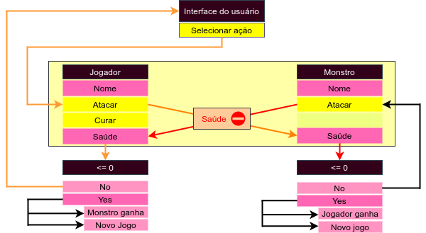

1. ### Hello world
    Crie um programa que imprima hello world na tela caso o atributo `__name__`, do arquivo, tenha nome `__main__`. [**Solução**](./main/main.py)
2. ### Fluxo

    1. Crie uma classe que imite o item "usuário". Esta classe deve conter a informação se o usuário encontra-se logado ou não como método construtor predefinido e uma segunda variável contendo uma mensagem otimizada conforme o valor da anterior para que seja apresentada pelo console. 
    
        Método | Solução
        ---|---
        Operador condicional | [**Solução**](../others/fluxo/condicional/A-AAE.py)
        Operador ternário | [**Solução**](../others/fluxo/ternário/A-AAE.py)
3. ### Dicionários
    Crie um jogo **Console** <--> **Usuário** de luta, com ajuda de dicionários para gerenciar as variáveis seguindo a estrutura seguinte. Utilize python caso não queira implementar um método dicionário.

[**Solução**](./dict/B-AAK.py)